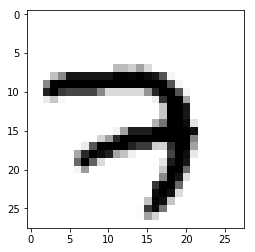
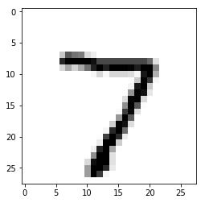

## MNIST Hand-written digit classification

### 2019/3/22 성남-KAIST 인공지능 집중교육과정

***Tip> shotcuts for Jupyter Notebook***
* Shift + Enter : run cell and select below

***Library***
* Numpy: Fundamenta package for scientific computing with Python
* Tensorflow: An open source machine learning library for research and production
* Matplotlib: Python 2D plottin glibrary


```python
from __future__ import print_function
from collections import namedtuple
from functools import partial

import numpy as np
import tensorflow as tf
import matplotlib.pyplot as plt
import time

from tensorflow.examples.tutorials.mnist import input_data
from tensorflow.python.training import moving_averages

tf.logging.set_verbosity(tf.logging.ERROR)
```

## 1. Prepare the data
### <a href=http://yann.lecun.com/exdb/mnist/>MNIST dataset</a>
The MNIST has a training set of 55,000 examples, a validation set of 5,000 examples and a test set of 10,000 examples.


```python
mnist = input_data.read_data_sets('./data/', one_hot=True)
```

    Extracting ./data/train-images-idx3-ubyte.gz
    Extracting ./data/train-labels-idx1-ubyte.gz
    Extracting ./data/t10k-images-idx3-ubyte.gz
    Extracting ./data/t10k-labels-idx1-ubyte.gz


Load the training dataset


```python
train_images = mnist.train.images
train_labels = mnist.train.labels
train_images = train_images.reshape([-1, 28, 28, 1])
```

Load the validation sets


```python
val_images = mnist.validation.images
val_labels = mnist.validation.labels
val_images = val_images.reshape([-1, 28, 28, 1])
```

Plot the 1st hand-written digit and its one-hot label


```python
plt.imshow(train_images[0,:,:,0], cmap='Greys')
print("\nOne-hot labels for this image:")
print(train_labels[0])
```


    One-hot labels for this image:
    [0. 0. 0. 0. 0. 0. 0. 1. 0. 0.]




</br>

## 2. Build a graph

### Set hyperparameters
- ***log_dir*** : Directory name to save models
- ***n_epochs*** : Maximun training epoch
- ***n_outputs*** : The number of classes for labels
- ***init_lr*** : Learning rate for gradient descent
- ***l2_lambda*** : regularization parameter
- ***batch_size*** : The number of images to update paramerters once


```python
log_dir = 'logs/'
n_epochs = 20
n_outputs = 10
init_lr = 0.01
batch_size = 100
l2_lambda = 0.0001
```

</br>

### Placeholder for learning rate, input images and labels


```python
images = tf.placeholder(tf.float32, shape=(None, 28, 28, 1), name='images')
labels = tf.placeholder(tf.int32, shape=(None), name='labels')
```

</br>

### DNN model


```python
def DNN(images):
    
    ''' 1st hidden layer '''
    x =                            # fully-connected layer with 200 units
    x =                            # batch normalization
    x =                            # ReLU activation
    
    ''' 2nd hidden layer '''
    x =                            # fully-connected layer with 100 units
    x =                            # batch normalization
    x =                            # tanh activation
    
    return x
```

</br>

### Build a model


```python
global_step = tf.Variable(0, trainable=False)

## Reshape
inputs = tf.reshape(images, [-1, 28*28])

with tf.variable_scope('embed') as scope:
    feats = DNN(inputs)

## Logits
logits = tf.layers.dense(feats, n_outputs, kernel_initializer=tf.uniform_unit_scaling_initializer(factor=2.0), 
                                               kernel_regularizer=tf.contrib.layers.l2_regularizer(l2_lambda))

## Evaluation
correct = tf.nn.in_top_k(logits, labels, 1)
accuracy = tf.reduce_mean(tf.cast(correct, tf.float32))

## SOFTMAX
preds = tf.nn.softmax(logits)

## Cost function
cent = tf.nn.softmax_cross_entropy_with_logits_v2(logits=logits, labels=labels)
cost_cls = tf.reduce_mean(cent, name='cent')
```

</br>

### L2 regularization


```python
reg_losses = tf.get_collection(tf.GraphKeys.REGULARIZATION_LOSSES)
cost = tf.add_n([cost_cls] + reg_losses)
```

</br>

### Momentum optimizer


```python
optimizer =                   # Momentum optimizer with momentum 0.9

```

</br>

# 3. Train a model

### Create a session and initialize parameters
Tensorflow operations must be executed in the session.


```python
## MAKE SESSION
sess = tf.Session()

## INITIALIZE SESSION
sess.run(tf.global_variables_initializer())
```

</br>

### Updates parameters with back-propagation


```python
start_time = time.time()

for epoch in range(n_epochs+1):
    for iteration in range(mnist.train.num_examples // batch_size):
        
        X_batch, y_batch = mnist.train.next_batch(batch_size)
        X_batch = X_batch.reshape([-1, 28, 28, 1])
        (_, loss, loss_cls, prediction) = sess.run([train_op, cost, cost_cls, preds], 
                                                    feed_dict={images: X_batch, labels: y_batch})
        duration = time.time() - start_time
        sec_per_batch = float(duration)
    
    ## Training accuracy every one epoch
    acc_train = accuracy.eval(session=sess, feed_dict={images: X_batch, labels: np.argmax(y_batch, axis=1)})
    if epoch % 1 == 0:
        print('  [*] TRAINING Iteration %d, Loss: %.4f, Acc: %.4f (duration: %.3fs)'
                             % (epoch, loss_cls, acc_train, sec_per_batch))

    ## Validation accuracy every 5 epochs
    if epoch % 5 == 0:
        acc_val = accuracy.eval(session=sess, feed_dict={images: val_images, labels: np.argmax(val_labels, axis=1)})
        print('  [*] VALIDATION ACC: %.3f' % acc_val)

print('Optimization done.')
```

      [*] TRAINING Iteration 0, Loss: 0.1393, Acc: 0.9800 (duration: 1.447s)
      [*] VALIDATION ACC: 0.938
      [*] TRAINING Iteration 1, Loss: 0.1997, Acc: 0.9500 (duration: 2.545s)
      [*] TRAINING Iteration 2, Loss: 0.2013, Acc: 0.9400 (duration: 3.703s)
      [*] TRAINING Iteration 3, Loss: 0.1167, Acc: 0.9800 (duration: 4.800s)
      [*] TRAINING Iteration 4, Loss: 0.2359, Acc: 0.9400 (duration: 5.963s)
      [*] TRAINING Iteration 5, Loss: 0.1116, Acc: 0.9800 (duration: 7.151s)
      [*] VALIDATION ACC: 0.971
      [*] TRAINING Iteration 6, Loss: 0.0688, Acc: 0.9900 (duration: 8.391s)
      [*] TRAINING Iteration 7, Loss: 0.1584, Acc: 0.9600 (duration: 9.672s)
      [*] TRAINING Iteration 8, Loss: 0.0415, Acc: 0.9900 (duration: 10.971s)
      [*] TRAINING Iteration 9, Loss: 0.0663, Acc: 0.9900 (duration: 12.214s)
      [*] TRAINING Iteration 10, Loss: 0.1180, Acc: 0.9800 (duration: 13.503s)
      [*] VALIDATION ACC: 0.977
      [*] TRAINING Iteration 11, Loss: 0.0124, Acc: 1.0000 (duration: 14.739s)
      [*] TRAINING Iteration 12, Loss: 0.0318, Acc: 0.9900 (duration: 16.016s)
      [*] TRAINING Iteration 13, Loss: 0.0648, Acc: 0.9900 (duration: 17.268s)
      [*] TRAINING Iteration 14, Loss: 0.0342, Acc: 0.9900 (duration: 18.402s)
      [*] TRAINING Iteration 15, Loss: 0.0784, Acc: 0.9800 (duration: 19.591s)
      [*] VALIDATION ACC: 0.979
      [*] TRAINING Iteration 16, Loss: 0.0547, Acc: 0.9900 (duration: 20.768s)
      [*] TRAINING Iteration 17, Loss: 0.0197, Acc: 1.0000 (duration: 21.981s)
      [*] TRAINING Iteration 18, Loss: 0.0494, Acc: 0.9900 (duration: 23.131s)
      [*] TRAINING Iteration 19, Loss: 0.0271, Acc: 1.0000 (duration: 24.292s)
      [*] TRAINING Iteration 20, Loss: 0.0527, Acc: 0.9800 (duration: 25.515s)
      [*] VALIDATION ACC: 0.980
    Optimization done.

<div style='page-break-after:always;'></div>

# 4. Test a model

### Load the test images and labels


```python
## READ MNIST INPUTS
test_images = mnist.test.images
test_labels = mnist.test.labels
test_images = test_images.reshape([-1, 28, 28, 1])

## Plot the 1st test image and label
plt.imshow(test_images[0,:,:,0], cmap='Greys')
print("\nOne-hot labels for this image:")
print(test_labels[0])
```


    One-hot labels for this image:
    [0. 0. 0. 0. 0. 0. 0. 1. 0. 0.]




</br>

### Check the prediction for the first image


```python
prediction = sess.run(preds, feed_dict={images: test_images[0,:,:,0].reshape(1,28,28,1), labels: test_labels[0]})

print("The prediction of the network is: %d" % np.argmax(prediction))
```

    The prediction of the network is: 7

</br>

### Average the accuray for test set


```python
test_acc = accuracy.eval(session=sess, feed_dict={images: test_images, labels: np.argmax(test_labels, axis=1)})
print('Acc: %.3f' % test_acc)
```

    Acc: 0.979

</br>

### The number of parameters

```python
n_parameters = 0
for var in tf.trainable_variables():
    n_parameters += tf.size(var)
n_dnn = sess.run(n_parameters)
print("The number of parameters: %d" % n_dnn)
```

    The number of parameters: 159410

```python
sess.close()
tf.reset_default_graph()
```

